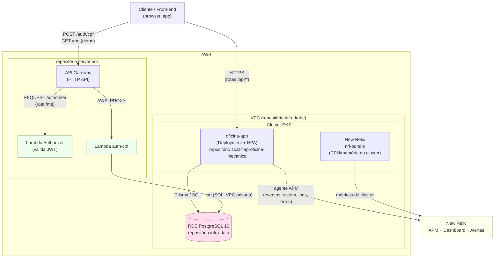

# Diagrama de Componentes

Visão geral do sistema após a Fase 3: nuvem (AWS), APIs, banco de dados e monitoramento,
cruzando os quatro repositórios.

Tokens JWT são emitidos pela `lambda` (login) e validados de duas formas independentes com o
**mesmo segredo** (`JWT_SECRET`): pelo `authorizer` nas rotas da API Gateway, e pelo middleware
`authenticate` do `app` nas rotas `/api/*` — nenhum dos dois depende do outro.

## Componentes por repositório

| Repositório | Componentes no diagrama |
|---|---|
| `soat-fiap-oficina-mecanica` | `app` (Deployment/Service/HPA), integração com `newrelic` (APM) |
| `soat-fiap-oficina-mecanica-serverless` | `apigw`, `authorizer`, `lambda` (acesso privado ao `rds`) |
| `soat-fiap-oficina-mecanica-infra-kube` | `VPC`, `EKS`, `nrk8s` (monitoramento de cluster), alertas e dashboard da New Relic |
| `soat-fiap-oficina-mecanica-infra-data` | `rds` |

Ver também: [diagrama de sequência](diagrama-sequencia.md) e [modelo de dados](../database/modelo-er.md).
