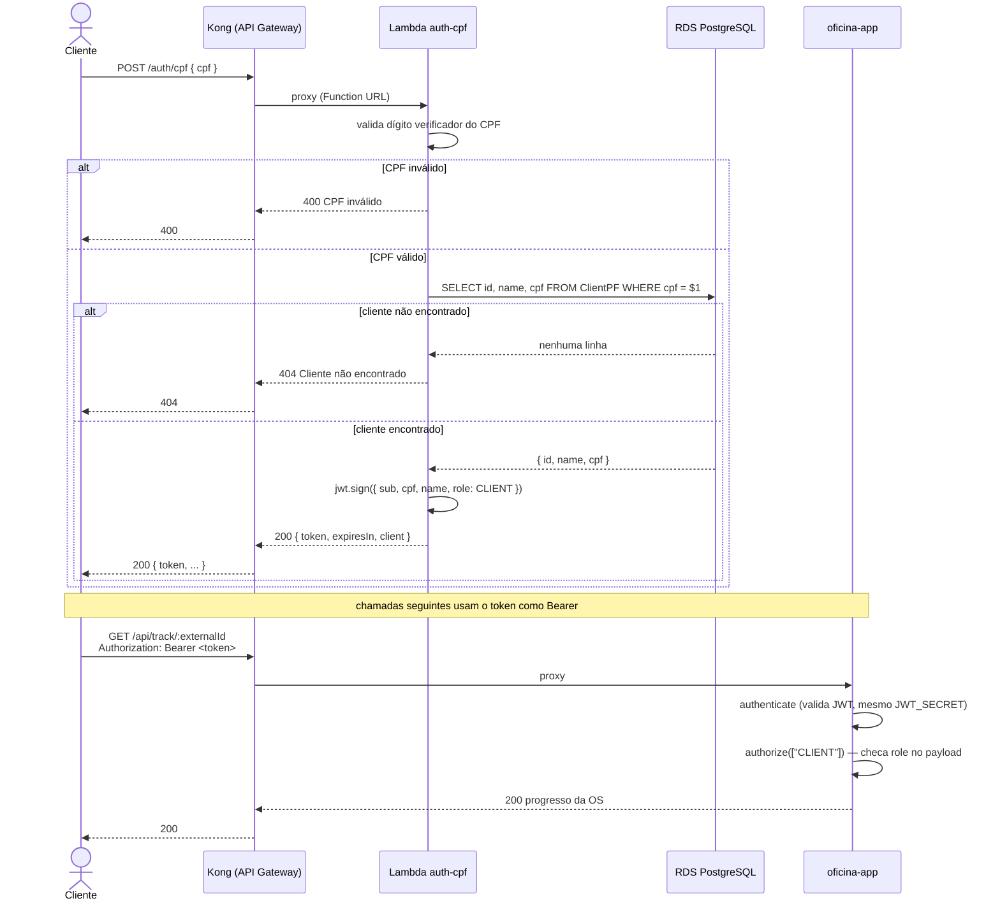
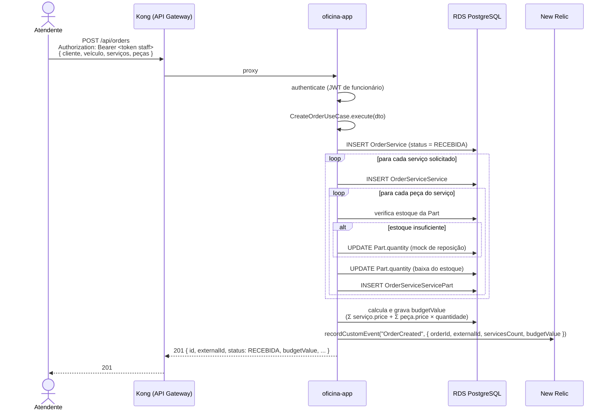

# Diagramas de Sequência

## 1. Autenticação do cliente via CPF e consulta protegida

## 2. Abertura de Ordem de Serviço

Ver também: [diagrama de componentes](diagrama-componentes.md) e [modelo de dados](../database/modelo-er.md).
