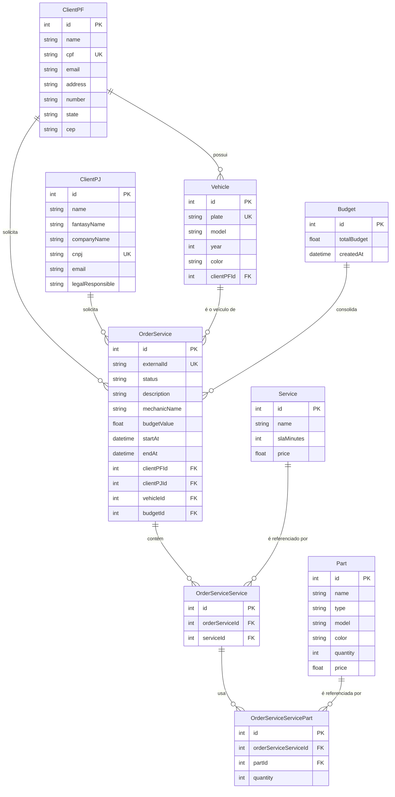

# Modelo de Dados — Diagrama ER e Justificativa

Justificativa formal da escolha do banco de dados: [ADR 0001](../adr/0001-uso-de-postgresql-como-banco-de-dados.md) e [RFC 0002](../rfc/0002-escolha-do-banco-de-dados.md). Este documento detalha o **modelo relacional** em si — entidades, relacionamentos e o porquê de cada ajuste.

## Diagrama ER

## Explicação dos relacionamentos

- **`ClientPF` / `ClientPJ` → `OrderService`** (1:N, ambos opcionais em `OrderService`): uma OS pertence a exatamente um cliente, que pode ser pessoa física **ou** jurídica — por isso `clientPFId` e `clientPJId` são ambos anuláveis em `OrderService` (mutuamente exclusivos na prática, validado na camada de aplicação, não via `CHECK` constraint no schema atual).
- **`ClientPF` → `Vehicle`** (1:N): um cliente PF pode ter vários veículos cadastrados. Veículos hoje só se associam a clientes PF (`clientPFId` obrigatório em `Vehicle`), refletindo o cadastro atual do domínio.
- **`Vehicle` → `OrderService`** (1:N): um veículo pode ter várias ordens de serviço ao longo do tempo (histórico de manutenções).
- **`OrderService` → `OrderServiceService`** (1:N): tabela associativa que representa "quais serviços foram solicitados nesta OS" — necessária porque `Service` é um catálogo reutilizável (troca de óleo, alinhamento, ...), não duplicado por OS.
- **`OrderServiceService` → `OrderServiceServicePart`** (1:N): peças usadas ficam associadas ao **serviço dentro da OS** (não à OS diretamente), porque uma peça é consumida na execução de um serviço específico (ex.: pastilha de freio é usada no serviço de "troca de freio", não na OS como um todo) — isso também é o que permite calcular o orçamento por composição (`Σ serviço.price + Σ peça.price × quantidade`).
- **`Part` → `OrderServiceServicePart`** (1:N, com `quantity`): peça é catálogo reutilizável; a quantidade consumida é um atributo do relacionamento (tabela associativa), não da peça em si — controle de estoque (`Part.quantity`) é decrementado à parte, na camada de aplicação, quando a peça é anexada a um serviço da OS.
- **`Budget` → `OrderService`** (1:N, opcional): representa o recurso administrativo de consolidar o orçamento de **múltiplas** ordens de serviço já existentes em um total combinado (`POST /api/budgets`) — é um relacionamento diferente do campo `OrderService.budgetValue`, que é o orçamento **daquela OS individual**, calculado automaticamente a partir dos seus próprios serviços/peças.

## Ajustes feitos no modelo ao longo das fases

- **`OrderService.externalId`** (`UUID`, único): existe especificamente para o fluxo de rastreamento público/protegido por CPF (`GET /api/track/:externalId`) — evita expor o `id` interno (sequencial, previsível) do banco em uma URL semi-pública.
- **`OrderService.budgetValue`** (calculado, não solicitado no `POST /orders`): mantém a garantia de que o orçamento é sempre derivado dos serviços/peças efetivamente anexados à OS, e não um valor arbitrário informado pelo cliente da API — recalculado sempre que um serviço ou peça é adicionado (`calculateOrderBudget`).
- **`OrderService.startAt` / `endAt`** (anuláveis): preenchidos pela máquina de estados (`OrderStatus`) conforme a OS avança para `EM_EXECUCAO` e `FINALIZADA`/`ENTREGUE` — usados tanto para as métricas de tempo médio de execução (`GET /api/metrics/average-execution-time`) quanto para os eventos customizados de observabilidade (`OrderStatusChanged.secondsInPreviousStatus`, ver [diagrama de componentes](../architecture/diagrama-componentes.md)).
